# Tasman Agentic Analytics

[](./VERSION)
[](https://www.python.org/)
[](./tests)
[](./LICENSE)

**🔗 [View Compass Demo](demo/)**: Explore our architecture through a contrasting good vs. bad agent implementation.

A **local-first, notebook-driven** agentic analytics platform that minimizes LLM usage through intelligent, rule-based agents. Provides template-driven search and statistical analysis with robust validation.

> **Version 0.2.0** - Major update adding Analysis Mode with 3 specialized agents: Hypothesis Testing, Driver Analysis, and Segmentation.

## 🎯 Key Features

### Search Mode (v0.1)
- **Local-first architecture**: Template matching and rule-based logic before any LLM calls
- **Minimal LLM usage**: Only calls LLM when local logic fails; aggressive filesystem caching
- **Config-driven**: Schema, business context, and SQL templates in YAML/JSON
- **Multi-role support**: Marketer, CEO, CPO, COO roles with tailored KPIs and dimensions
- **Automatic visualization**: Smart chart generation based on data characteristics
- **Read-only safety**: SQL execution with guardrails and LIMIT enforcement

### Analysis Mode (v0.2 - NEW!)
- **Hypothesis Testing**: A/B tests, t-tests, chi-squared, ANOVA with FDR correction
- **Driver Analysis**: Logistic/linear regression, feature importance, cross-validation
- **Segmentation**: K-means, RFM, DBSCAN clustering with auto k-selection
- **Statistical rigor**: Bootstrapping, effect sizes, confidence intervals
- **Stratified sampling**: Automatic sampling for large datasets
- **Natural language plans**: Parse questions into statistical analysis plans

## 📂 Project Structure

```
tasman-marketing-agent/
├── notebooks/
│   └── Agentic_Analytics_Demo.ipynb   # Main demo notebook
├── config/
│   ├── schema.json                     # Database schema definition
│   ├── db.yaml                         # Database connection config
│   ├── business_context.yaml           # Roles, KPIs, synonyms
│   ├── sql_templates.yaml              # Canonical query templates
│   └── analysis.yaml                   # Analysis agent configuration (NEW!)
├── core/
│   ├── duckdb_connector.py             # Read-only DB connector
│   ├── local_text_to_sql.py            # Template-based SQL generation
│   ├── triage_local.py                 # Rule-based query triage
│   ├── llm_clients.py                  # OpenAI/Anthropic clients + caching
│   ├── analysis_utils.py               # Statistical utilities (NEW!)
│   └── viz.py                          # Auto-visualization
├── agents/
│   ├── agent_triage.py                 # Triage orchestration
│   ├── agent_text_to_sql.py            # SQL generation orchestration
│   ├── agent_search.py                 # End-to-end search agent
│   ├── base_analysis_agent.py          # Base class for analysis agents (NEW!)
│   ├── agent_hypothesis.py             # Hypothesis testing agent (NEW!)
│   ├── agent_driver.py                 # Driver analysis agent (NEW!)
│   └── agent_segmentation.py           # Segmentation agent (NEW!)
├── tests/                              # pytest test suite (141 tests)
├── data/                               # DuckDB database location
└── .env                                # Environment variables
```

## 🚀 Quick Start

This project uses [uv](https://github.com/astral-sh/uv) for fast package management and includes a Makefile for convenience.

### 1. Install Dependencies

```bash
# Install uv (if not already installed)
curl -LsSf https://astral.sh/uv/install.sh | sh

# Install project dependencies
make install
# or: uv sync
```

### 2. Configure Environment

```bash
# Copy example env file
cp .env.example .env

# Edit .env and add your API keys (optional - system works without them!)
# nano .env
```

### 3. Generate Sample Database

Create a sample database with synthetic marketing data:

```bash
make sample-data
# or: uv run python scripts/create_sample_data.py
```

This creates `./data/marketing.duckdb` with:
- 20 campaigns, 5 channels, 365 days of data
- 10,963 sessions, 3,391 orders
- Full schema with 8 tables

**Using your own database?** Update `config/db.yaml` and ensure your schema matches `config/schema.json`.

### 4. Launch Jupyter Notebook

```bash
make run
# or: uv run jupyter notebook notebooks/Agentic_Analytics_Demo.ipynb
```

### 5. Verify Installation

```bash
make test
# or: uv run pytest tests/ -v
```

All 141 tests should pass ✅

## 🏗️ Architecture

### System Overview


### Analysis Agent Architecture

```mermaid
graph TB
    subgraph "Base Analysis Agent"
        BaseAgent[BaseAnalysisAgent<br/>plan → pull → run → report]
    end

    subgraph "Specialized Agents"
        Hypothesis[HypothesisTestingAgent<br/>- Proportion tests<br/>- t-tests<br/>- Chi-squared<br/>- ANOVA]
        Driver[DriverAnalysisAgent<br/>- Logistic regression<br/>- Linear regression<br/>- Feature importance<br/>- Cross-validation]
        Segmentation[SegmentationAgent<br/>- K-means clustering<br/>- RFM segmentation<br/>- DBSCAN outliers<br/>- Silhouette scoring]
    end

    subgraph "Core Utilities"
        Utils[analysis_utils.py<br/>- Stratified sampling<br/>- Categorical encoding<br/>- Statistical tests<br/>- Preprocessing]
    end

    BaseAgent --> Hypothesis
    BaseAgent --> Driver
    BaseAgent --> Segmentation

    Hypothesis --> Utils
    Driver --> Utils
    Segmentation --> Utils

    style BaseAgent fill:#4A90E2
    style Hypothesis fill:#BD10E0
    style Driver fill:#BD10E0
    style Segmentation fill:#BD10E0
    style Utils fill:#50E3C2
```



### Analysis Workflow (Plan → Pull → Run → Report)


### Statistical Methods by Agent

```mermaid
mindmap
  root((Analysis<br/>Agents))
    HypothesisTestingAgent
      Proportion Tests
        Two-sample z-test
        Chi-squared test
      Continuous Tests
        Welch's t-test
        ANOVA
      Corrections
        Benjamini-Hochberg FDR
        Bonferroni
    DriverAnalysisAgent
      Binary Outcomes
        Logistic Regression
        Lasso regularization
        ROC AUC scoring
      Continuous Outcomes
        Linear Regression
        Ridge regularization
        R² scoring
      Feature Analysis
        Permutation importance
        Cross-validation
        One-hot encoding
    SegmentationAgent
      K-means
        Auto k-selection
        Silhouette scoring
        Standardization
      RFM
        Quintile scoring
        Customer profiling
        Revenue-based ranking
      DBSCAN
        Density clustering
        Outlier detection
        Eps tuning
```



## 🧠 How It Works

### Query Flow

```
User Question
    ↓
[1] Triage (Rule-based → LLM fallback)
    ↓
[2] Text-to-SQL (Template match → LLM fallback)
    ↓
[3] Execute SQL (Read-only, LIMIT enforced)
    ↓
[4] Visualize (Auto chart type detection)
    ↓
[5] Summarize (Natural language result)
```

### Local-First Design

The system **minimizes LLM calls** through:

1. **Rule-based triage**: Keyword matching to classify queries as "search" vs "analysis"
2. **Template library**: Pre-built SQL templates for common queries (6+ templates included)
3. **Synonym mapping**: Role-specific vocabulary (e.g., "revenue" = "sales" = "takings")
4. **Entity extraction**: Automatically identify KPIs, dimensions, and time ranges
5. **Filesystem cache**: Hash-based caching of LLM responses

**Result**: For template-matched queries, zero LLM calls. For novel queries, one LLM call then cached.

## 📊 Example Usage

### Search Mode (v0.1)

```python
from agents.agent_search import SearchAgent

search_agent = SearchAgent(db_connector, config)

# Template-matched query (no LLM)
result = search_agent.search(
    question="show ad spend per channel over time",
    role="marketer"
)

# Novel query (LLM fallback, then cached)
result = search_agent.search(
    question="what are the top 10 products by revenue in the last 30 days?",
    role="cpo"
)

# Auto role detection
result = search_agent.search(
    question="conversion rate by device"
)
```

### Analysis Mode (v0.2 - NEW!)

```python
from agents.agent_hypothesis import HypothesisTestingAgent
from agents.agent_driver import DriverAnalysisAgent
from agents.agent_segmentation import SegmentationAgent

# Initialize agents
hypothesis_agent = HypothesisTestingAgent(db_connector, config)
driver_agent = DriverAnalysisAgent(db_connector, config)
segmentation_agent = SegmentationAgent(db_connector, config)

# Hypothesis Testing: Compare conversion rates
result = hypothesis_agent.execute(
    question="Is conversion rate different between mobile and desktop?",
    role="analyst"
)
# Returns: test statistic, p-value, effect size, confidence intervals, insights

# Driver Analysis: Find what drives revenue
result = driver_agent.execute(
    question="What are the key drivers of revenue?",
    role="analyst"
)
# Returns: feature importance, coefficients, model metrics, cross-validation scores

# Segmentation: Create customer segments
result = segmentation_agent.execute(
    question="Segment customers by value",
    role="analyst"
)
# Returns: k segments, silhouette score, segment profiles, sizes, characteristics
```

### Sample Output

```
QUESTION: show ad spend per channel over time
ROLE: marketer
================================================================================

📋 STEPS:
  Triage: ⚡ (Local)
    Confidence: 0.90
  SQL Generation: ⚡ (Local)
    Method: template_match
    Confidence: 0.95

📊 STATUS: success

💾 SQL QUERY:
SELECT c.channel, f.date, SUM(f.spend) AS total_spend
FROM fact_ad_spend f
JOIN dim_campaigns c ON f.campaign_id = c.campaign_id
WHERE f.date >= CURRENT_DATE - INTERVAL 90 DAY
GROUP BY 1,2
ORDER BY 2 ASC, 1
LIMIT 1000;

📊 RESULTS (245 rows)
[DataFrame preview with chart]
```

## 🧪 Running Tests

```bash
# Run all tests
make test

# Run with verbose output
make test-v

# Run with coverage report
make test-cov

# Run specific test file
uv run pytest tests/test_local_text_to_sql.py -v
```

## 🛠️ Makefile Commands

The project includes a Makefile for common tasks:

```bash
make help         # Show all available commands
make install      # Install dependencies
make sample-data  # Generate sample database
make test         # Run test suite
make test-cov     # Run tests with coverage
make run          # Launch Jupyter notebook
make clean        # Remove cache files
make check        # Run all checks (test + lint)
```

## 🎨 Configuration

### Adding New SQL Templates

Edit `config/sql_templates.yaml`:

```yaml
- id: my_new_template
  utterances:
    - "show me X by Y"
    - "plot X over time"
  role_hint: "marketer"
  sql: |
    SELECT ...
    WHERE date >= CURRENT_DATE - INTERVAL {{time_window_days}} DAY
    LIMIT {{limit}};
  dims: [channel, date]
  measures: [spend]
```

### Adding New Roles

Edit `config/business_context.yaml`:

```yaml
roles:
  my_role:
    kpis: [revenue, orders, margin]
    dims: [region, category]
    synonyms:
      revenue: [sales, takings]
    defaults:
      time_window_days: 90
```

### Switching LLM Providers

In `.env`:

```bash
# Use OpenAI
MODEL_PROVIDER=openai
OPENAI_API_KEY=sk-...
OPENAI_MODEL=gpt-4o-mini

# Or use Anthropic
MODEL_PROVIDER=anthropic
ANTHROPIC_API_KEY=sk-ant-...
ANTHROPIC_MODEL=claude-3-5-haiku-20241022
```

## 🔧 Architecture Decisions

### Why Local-First?

- **Cost**: Minimize expensive LLM API calls
- **Speed**: Local matching is instant
- **Reliability**: Works offline for known queries
- **Transparency**: Full observability of decision logic

### Why DuckDB?

- **Fast**: In-process analytical queries
- **Portable**: Single-file database
- **SQL-complete**: Full analytical SQL support
- **Read-only mode**: Safety for analytics workloads

### Why Notebooks?

- **Exploratory**: Natural fit for analytics
- **Iterative**: Easy to experiment and refine
- **Sharable**: Mix code, results, and narrative
- **Production-ready**: Core logic can be extracted to scripts

## 📦 Version 0.2.0 - Current State

### ✅ What's Included

**Search Mode (v0.1):**
- ✅ Local-first architecture with template matching
- ✅ Rule-based triage (search vs analysis)
- ✅ 6 pre-built SQL templates
- ✅ Multi-role support (4 roles)
- ✅ Automatic visualization
- ✅ LLM fallback (OpenAI + Anthropic)
- ✅ Filesystem caching
- ✅ Read-only database safety

**Analysis Mode (v0.2 - NEW!):**
- ✅ **Hypothesis Testing Agent** - A/B tests, t-tests, chi-squared, ANOVA, FDR correction
- ✅ **Driver Analysis Agent** - Logistic/linear regression, feature importance, cross-validation
- ✅ **Segmentation Agent** - K-means, RFM, DBSCAN clustering with auto k-selection
- ✅ **Base Analysis Agent** - Shared plan→pull→run→report workflow
- ✅ **Statistical Utilities** - Stratified sampling, categorical encoding, 20+ statistical functions
- ✅ **Natural Language Parsing** - Extract parameters from questions
- ✅ **SQL Template Generation** - Dynamic query building for analysis

**Testing & Quality:**
- ✅ 141 unit tests (100% passing)
- ✅ Comprehensive test coverage for all agents
- ✅ Synthetic data generators for testing
- ✅ Edge case and integration tests
- ✅ pytest fixtures and mocks

**Developer Experience:**
- ✅ Makefile for common tasks
- ✅ Interactive Jupyter notebook
- ✅ Environment configuration
- ✅ Detailed architecture documentation
- ✅ Mermaid diagrams

### ⏳ What's Not Included (Yet)

**Planned for v0.3+:**
- ⏳ Cohort & Retention Analysis Agent
- ⏳ Attribution & ROAS Agent
- ⏳ Anomaly & Trend Break Detection Agent
- ⏳ Analysis Plan Builder (meta-agent)
- ⏳ Multi-query decomposition
- ⏳ Web UI (Flask/FastAPI)
- ⏳ Observability dashboard
- ⏳ Streaming results
- ⏳ Natural language chart annotations

### 🎯 Production Readiness

**Ready for production:**
- Search mode queries
- Template-matched analytics
- Role-based KPI access
- SQL execution safety
- Hypothesis testing (with proper validation)
- Driver analysis (with cross-validation)
- Customer segmentation (with quality metrics)

**Use with caution:**
- Novel queries (requires LLM configuration)
- Large result sets (automatic sampling applied)
- Concurrent users (notebook is single-user)
- Analysis on small samples (< 100 rows)

**Not production-ready:**
- Remaining analysis agents (cohort, attribution, anomaly)
- Web API (use notebook for now)
- Multi-user access (no authentication)

## 📈 Roadmap

### ✅ Phase 1 (v0.1.0) - COMPLETE
- ✅ Local-first search mode
- ✅ Template-based SQL generation
- ✅ Multi-role support
- ✅ Auto-visualization
- ✅ LLM fallback with caching

### ✅ Phase 2 (v0.2.0) - COMPLETE
- ✅ Hypothesis Testing Agent
- ✅ Driver Analysis Agent
- ✅ Segmentation Agent
- ✅ Base analysis agent infrastructure
- ✅ Statistical utilities library
- ✅ Natural language parsing
- ✅ 141 comprehensive tests

### 🚧 Phase 3 (v0.3.0) - IN PROGRESS
- [ ] Cohort & Retention Analysis Agent
- [ ] Attribution & ROAS Agent
- [ ] Anomaly & Trend Break Detection Agent
- [ ] Analysis Plan Builder (meta-agent)
- [ ] Notebook demos for all analysis agents
- [ ] Complete user documentation

### 🔮 Future Phases
- [ ] Multi-query workflows (decompose complex questions)
- [ ] Observability dashboard (token usage, cache hits, latency)
- [ ] Web UI (Flask/FastAPI frontend)
- [ ] Streaming results (for large datasets)
- [ ] Natural language chart annotations
- [ ] Authentication & authorization
- [ ] Multi-user support
- [ ] Query history & favorites
- [ ] Scheduled queries
- [ ] Alert system

## 🤝 Contributing

This project is actively developed. To extend:

**Search Mode:**
1. Add more templates to `config/sql_templates.yaml`
2. Add more roles to `config/business_context.yaml`
3. Extend `LocalTriage` with more sophisticated rules
4. Add more chart types to `core/viz.py`

**Analysis Mode:**
1. Create new analysis agents by extending `BaseAnalysisAgent`
2. Add statistical methods to `core/analysis_utils.py`
3. Configure agent parameters in `config/analysis.yaml`
4. Write comprehensive tests with synthetic data generators
5. Follow the plan→pull→run→report workflow pattern

## 📄 License

MIT

## 🙏 Acknowledgments

Built with:
- [DuckDB](https://duckdb.org/) - Fast analytical database
- [uv](https://github.com/astral-sh/uv) - Fast Python package manager
- [OpenAI](https://openai.com/) / [Anthropic](https://anthropic.com/) - LLM providers
- [Jupyter](https://jupyter.org/) - Interactive notebook environment

---

**Questions?** Open an issue or check the notebook for detailed examples
