# Demo 2: Production-Grade Modular Agent Architecture

## Presentation Diagram (16:9 Landscape)

```mermaid
graph LR
    %% Styling
    classDef llm fill:#FFE87C,stroke:#E6B800,stroke-width:3px,color:#000
    classDef deterministic fill:#A8D5E2,stroke:#0066CC,stroke-width:2px,color:#000
    classDef validation fill:#FFB3BA,stroke:#CC0000,stroke-width:2px,color:#000
    classDef semantic fill:#C7E9C0,stroke:#00AA44,stroke-width:3px,color:#000
    classDef output fill:#E6CCE6,stroke:#9933CC,stroke-width:2px,color:#000

    %% Input
    Q["📊 Business Question<br/>'Which channel should I shift budget to?'"]

    %% Section 1-2: Setup
    ENV["🔧 Environment<br/>DB + Semantic Layer"]:::deterministic

    %% Section 3-4: Triage Agent
    TRIAGE_LOCAL["🔍 Triage: Local Rules<br/>Keyword matching<br/>(80% of queries)"]:::deterministic
    TRIAGE_LLM["🤖 Triage: LLM Fallback<br/>DSPy signature<br/>(20% edge cases)"]:::llm
    TRIAGE_OUT["✓ Mode: 'analysis'<br/>Confidence: 0.95"]:::validation

    %% Section 5: Text-to-Semantic
    T2S_TEMPLATE["📋 Text-to-Semantic<br/>Template matching<br/>'CAC by channel'"]:::deterministic
    T2S_LLM["🤖 LLM Fallback<br/>Map to semantic catalog"]:::llm
    T2S_VALIDATE["✓ Validate metric exists<br/>in semantic.yml"]:::validation

    %% Section 6: Semantic Layer
    SEMANTIC["🗂️ Semantic Layer<br/>semantic.yml<br/>• Canonical SQL<br/>• Join rules<br/>• Metric definitions"]:::semantic

    %% Section 7: Metric Execution
    RUNNER["⚙️ MetricRunner<br/>• Compile SQL<br/>• Execute query<br/>• Return DataFrame"]:::deterministic
    DATA["📈 Data:<br/>CAC by Channel<br/>ROAS by Channel"]:::output

    %% Section 8: Hypothesis Testing
    HYPO_DET["📊 Deterministic Hypothesis<br/>• Sort by CAC<br/>• Bootstrap CI (10k)<br/>• 95% confidence interval"]:::deterministic
    HYPO_LLM["🤖 LLM Hypothesis<br/>• Playbook (200+ lines)<br/>• Pre-calculated data<br/>• Validated output"]:::llm
    HYPO_OUT["✓ Hypothesis:<br/>'Shift 5% from X to Y'<br/>Expected: -$2.50 CAC"]:::validation

    %% Section 9: Narration
    NARRATOR["📝 NarratorAgent<br/>• DSPy signature<br/>• Constrained output<br/>• Cite metrics"]:::llm
    NARRATE_VAL["✓ Validate:<br/>• Length 2-4 sentences<br/>• Includes metric names"]:::validation

    %% Section 10: Observability
    OBS["📋 Observability<br/>• Run ID<br/>• SQL queries logged<br/>• Timings tracked<br/>• Method used"]:::output

    %% Section 11: Tests
    TESTS["✅ Inline Tests<br/>• Triage accuracy ≥75%<br/>• Semantic validation<br/>• Narration constraints"]:::validation

    %% Flow
    Q --> ENV
    ENV --> Q
    Q --> TRIAGE_LOCAL
    TRIAGE_LOCAL -->|"Ambiguous"| TRIAGE_LLM
    TRIAGE_LOCAL -->|"Clear"| TRIAGE_OUT
    TRIAGE_LLM --> TRIAGE_OUT

    TRIAGE_OUT --> T2S_TEMPLATE
    T2S_TEMPLATE -->|"No match"| T2S_LLM
    T2S_TEMPLATE -->|"Matched"| T2S_VALIDATE
    T2S_LLM --> T2S_VALIDATE

    T2S_VALIDATE --> SEMANTIC
    SEMANTIC --> RUNNER
    RUNNER --> DATA

    DATA --> HYPO_DET
    DATA --> HYPO_LLM
    HYPO_DET --> HYPO_OUT
    HYPO_LLM --> HYPO_OUT

    HYPO_OUT --> NARRATOR
    NARRATOR --> NARRATE_VAL

    NARRATE_VAL --> OBS
    OBS --> TESTS

    TESTS --> FINAL["🎯 Final Output<br/>Validated, Observable,<br/>Testable, Reproducible"]:::output

    %% Legend positioning
    subgraph Legend
        L1["🤖 LLM (3 fallback points)"]:::llm
        L2["⚙️ Deterministic (12 steps)"]:::deterministic
        L3["✓ Validation Gate (5 checks)"]:::validation
        L4["🗂️ Semantic Layer"]:::semantic
    end
```

## Key Statistics

| Metric | Value |
|--------|-------|
| **Total Decision Points** | 15 |
| **LLM Calls** | 3 (fallback only) |
| **Deterministic Steps** | 12 (primary path) |
| **Validation Gates** | 5 |
| **LLM Usage %** | ~20% (only for ambiguous cases) |

## Architecture Principles

### 1. Local-First, LLM-Fallback
- 80% of queries resolve with keyword matching
- LLMs only for edge cases

### 2. Validation Everywhere
- 5 validation gates prevent invalid outputs
- Semantic layer enforces metric catalog

### 3. Observable & Testable
- Every decision logged with method used
- Inline tests validate accuracy

### 4. Reproducible
- Run IDs track provenance
- Deterministic primary path
- Versioned semantic definitions

## Contrast with Demo 1 (Bad)

| Aspect | Demo 1 (Bad) | Demo 2 (Good) |
|--------|--------------|---------------|
| **LLM Usage** | 100% (one-shot) | 20% (fallback) |
| **SQL Generation** | LLM (error-prone) | Semantic layer (validated) |
| **Validation** | None | 5 gates |
| **Testability** | Not testable | 3 test suites |
| **Observability** | None | Full provenance |
| **Cost per query** | High | Low (mostly deterministic) |
