# Compass Demo: Bad vs Good Agent Architecture

This demo showcases the **correct** way to build LLM-powered analytics agents by contrasting two approaches:

## 📁 Contents

### Notebooks

- **`01_bad_oneshot_raw.ipynb`** - Anti-pattern demonstration
  - Shows what goes wrong with one-shot LLM on raw data
  - Intentional failures: wrong joins, time window drift, metric errors
  - Demonstrates overconfident but incorrect results

- **`02_good_modular_dspy.ipynb`** - Production-grade implementation
  - Modular DSPy agent architecture
  - Semantic layer integration
  - Reproducible, testable, observable
  - Quantified uncertainty with confidence intervals

### Utilities (`utils/`)

Lightweight support modules (clean-room implementation):

- `env_loader.py` - Environment variable management
- `db_connector.py` - DuckDB connection with schema validation
- `semantic_parser.py` - Semantic layer YAML parser and SQL compiler
- `plotting.py` - Matplotlib helpers for channel metrics
- `observability.py` - Run record for reproducibility

## 🎯 Business Question

Both notebooks address the same question:

> "Which channel mix change is most likely to improve CAC next month, given a recent anomaly in referral traffic?"

## 🏛️ Architecture Comparison

```mermaid
flowchart TB
    subgraph bad["‚ùå BAD: One-Shot LLM on Raw Data"]
        direction TB
        Q1[Business Question]
        L1[LLM]
        S1[Raw SQL Generation]
        D1[(DuckDB<br/>8 Tables)]
        R1[Results]
        N1[Narrative]

        Q1 -->|Schema Dump| L1
        L1 -->|Unvalidated SQL| S1
        S1 -->|Direct Query| D1
        D1 -->|Wrong Data| R1
        R1 -->|Overconfident| N1

        style L1 fill:#ff6b6b,stroke:#c92a2a,color:#fff
        style S1 fill:#ff6b6b,stroke:#c92a2a,color:#fff
        style R1 fill:#ff6b6b,stroke:#c92a2a,color:#fff
        style N1 fill:#ff6b6b,stroke:#c92a2a,color:#fff

        F1["⚠️ FAILURES:<br/>• Wrong joins<br/>• Time drift<br/>• Metric errors<br/>• No validation<br/>• No CI"]
        style F1 fill:#fff,stroke:#c92a2a,stroke-width:2px,stroke-dasharray: 5 5
    end

    subgraph good["‚úÖ GOOD: Modular DSPy Agent Architecture"]
        direction TB
        Q2[Business Question]
        T[TriageAgent<br/>Local Rules]
        TS[TextToSemantic<br/>Template Match]
        SL[(Semantic Layer<br/>semantic.yml)]
        MR[MetricRunner<br/>SQL Compiler]
        DB[(DuckDB<br/>8 Tables)]
        H[HypothesisAgent<br/>Bootstrap CI]
        NR[NarratorAgent<br/>Constrained Output]
        O[Observability<br/>Run Record]

        Q2 -->|Classify| T
        T -->|analysis| TS
        TS -->|Semantic Request| SL
        SL -->|Compile Query| MR
        MR -->|Safe SQL| DB
        DB -->|Validated Data| H
        H -->|Projection + CI| NR
        NR -->|Decision Memo| O

        style T fill:#51cf66,stroke:#2f9e44,color:#000
        style TS fill:#51cf66,stroke:#2f9e44,color:#000
        style SL fill:#339af0,stroke:#1971c2,color:#fff
        style MR fill:#51cf66,stroke:#2f9e44,color:#000
        style H fill:#51cf66,stroke:#2f9e44,color:#000
        style NR fill:#51cf66,stroke:#2f9e44,color:#000
        style O fill:#ffd43b,stroke:#f59f00,color:#000

        V["✓ GUARANTEES:<br/>• Canonical metrics<br/>• Validated joins<br/>• Consistent windows<br/>• Quantified uncertainty<br/>• Full provenance"]
        style V fill:#fff,stroke:#2f9e44,stroke-width:2px,stroke-dasharray: 5 5
    end

    style bad fill:#fff5f5,stroke:#c92a2a,stroke-width:3px
    style good fill:#f3faf3,stroke:#2f9e44,stroke-width:3px
```



### Key Architectural Differences

| Aspect | Bad Approach | Good Approach |
|--------|-------------|---------------|
| **Data Access** | Direct LLM → SQL → Database | Semantic Layer → Compiled SQL → Database |
| **Validation** | None | Schema validation, sanity checks, inline tests |
| **Metric Definitions** | Ad-hoc in SQL | Canonical in semantic.yml |
| **Join Logic** | Uncontrolled | Enforced join rules |
| **Time Windows** | Inconsistent | Centralized defaults |
| **Uncertainty** | None | Bootstrap confidence intervals |
| **Observability** | None | Full run record with provenance |
| **Reproducibility** | Impossible | Run ID + versioned specs |
| **LLM Usage** | Heavy (SQL generation) | Minimal (ambiguity resolution only) |
| **Testing** | None | Comprehensive inline tests |

## 🏗️ Architecture Principles (Good Demo)

1. **Semantic Layer First** - All metrics defined in `config/semantic.yml`
2. **Modular Agents** - Small, focused components with clear contracts
3. **Local-First Logic** - Deterministic rules; LLM only for ambiguity
4. **DSPy Signatures** - Structured, declarative prompts
5. **Observability** - Every decision logged with provenance

## 🚀 Quick Start

### Prerequisites

```bash
# Install dependencies
pip install duckdb pandas numpy matplotlib pyyaml dspy-ai openai python-dotenv

# Ensure .env file exists with OPENAI_API_KEY
cp ../.env.example ../.env  # if needed
```

### Run the Demos

```bash
# From repo root
cd demo

# Bad demo (60-90 seconds)
jupyter notebook 01_bad_oneshot_raw.ipynb

# Good demo (3-4 minutes)
jupyter notebook 02_good_modular_dspy.ipynb
```

## 📊 Data Source

- Database: `../data/synthetic_data.duckdb` (read-only)
- Schema: 8 tables (dimensions + facts)
- Semantic layer: `../config/semantic.yml`

## 🎭 Agent Pipeline (Good Demo)

```
Question → Triage → Text-to-Semantic → Metric Compilation → Execution →
          Hypothesis Simulation → Narration → Observability
```

### Agent Roles

1. **TriageAgent** - Classify question type (search vs analysis)
2. **TextToSemanticAgent** - Map NL to semantic request
3. **MetricRunner** - Compile and execute SQL from semantic layer
4. **HypothesisAgent** - Simulate budget scenarios with bootstrap CI
5. **NarratorAgent** - Generate decision memo with constraints

## ✅ Acceptance Criteria

### Bad Demo

- [x] SQL runs but produces wrong results
- [x] Confidently wrong narrative
- [x] 3+ documented failure modes

### Good Demo

- [x] No raw LLM SQL generation
- [x] Reproducible with run_id and versioning
- [x] Quantified CAC projection with 95% CI
- [x] Concise narration with risks and next steps
- [x] All inline tests pass

## 📈 Outputs

The good demo produces:

- **Charts**: CAC by channel, ROAS by channel, hypothesis comparison
- **Run Record**: JSON with full provenance (`outputs/run_*.json`)
- **Metrics**: Query IDs, timings, row counts
- **Tests**: Schema validation, SQL compilation, sanity checks

## 🔑 Key Differences

| Bad Demo | Good Demo |
|----------|-----------|
| One-shot LLM on raw data | Modular agents with semantic layer |
| No validation | Schema validation + sanity checks + tests |
| Wrong joins, time windows | Enforced in semantic.yml |
| No confidence intervals | Bootstrap CI for projections |
| Overconfident narratives | Constrained output with risks |
| No reproducibility | Full observability with run_id |

## 📝 Notes

- **Clean-room implementation**: No imports from existing agent code
- **Local-first**: LLM used only in narrow fallback paths
- **DSPy**: Signatures define agent contracts; enables future optimization
- **Offline mode**: Set `OFFLINE_MODE=True` in good demo to disable LLM calls

## 🎤 Demo Choreography

### Bad Demo (60-90s)
1. Show raw table schemas (no guidance)
2. Run one-shot LLM prompt
3. Display overconfident but wrong results
4. Highlight failure modes

### Good Demo (3-4 mins)
1. Load semantic catalogue
2. Show triage → semantic JSON
3. Display compiled SQL IDs → charts
4. Present hypothesis result with CI
5. Show narrator memo
6. Display observability JSON

## 📚 Further Reading

- DSPy: https://github.com/stanfordnlp/dspy
- Semantic layers: https://www.getdbt.com/blog/what-is-a-semantic-layer/
- Bootstrap confidence intervals: https://en.wikipedia.org/wiki/Bootstrapping_(statistics)

---

**Version**: 1.0.0
**Date**: November 2025
**Status**: Production-ready demonstration
